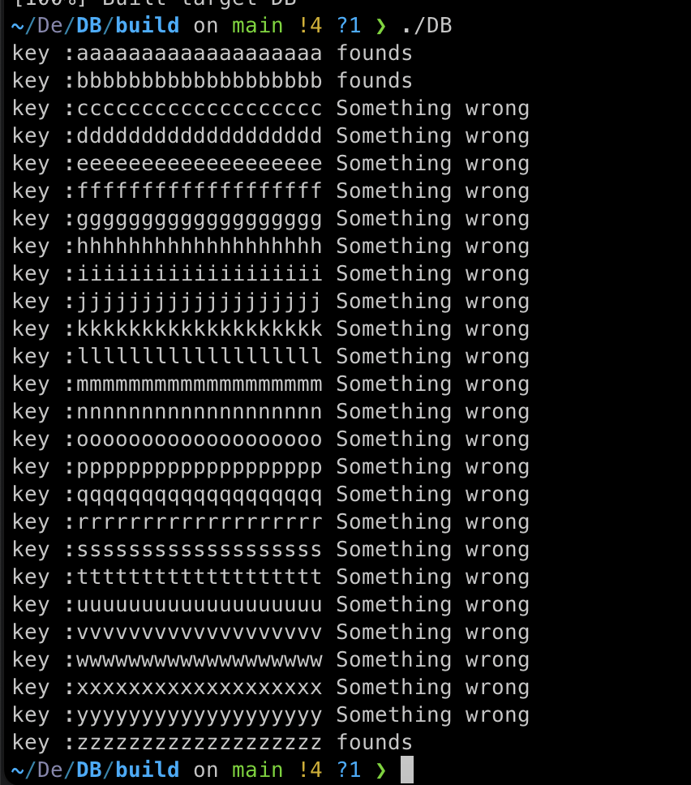

# 데이터베이스

## 🗓️기간
2023.05.04. ~ 2023.06.14

## ⚙️기술
- C++

## 📖소개
C++을 사용해 데이터베이스의 Slotted Page, B+Tree를 구현합니다.

## ✅기능
1. 가변 길이 데이터 저장
2. 저장에 따라 트리 구조 변화
3. 데이터 저장 및 탐색

## 👥역할
- 개인 프로젝트

## 🚀실행
소스 코드를 make 명령어를 통해 실행합니다.

